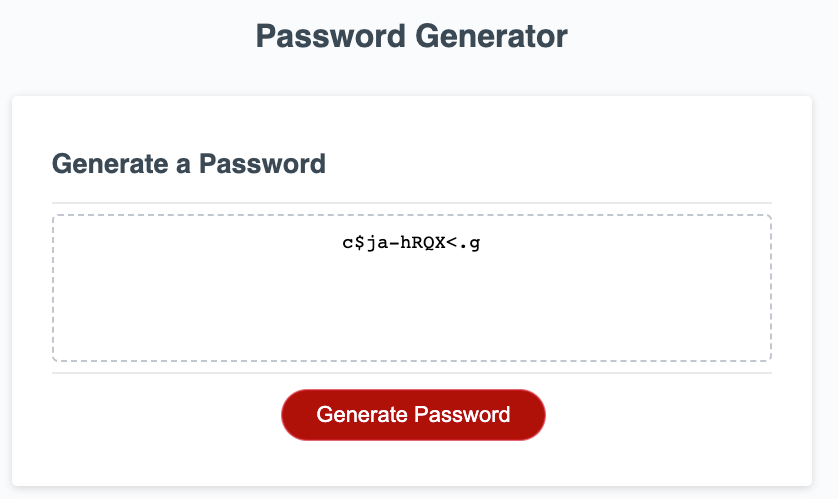

# Password Generator

Create an application that generate random passwords based on criteria that they've selected by modifying the starter code.

## User Story

When you sign up, you are asked to create a password and the criteria is all different.
I want to randomly generate a password that meets certain criteria on my choice.

## Acceptance Criteria

* When I click the button to generate a password, there are a series of prompts for password criteria.
* I can choose a length of password.(should be at least 8 and no more that 128 character).
* It will prompt again if it is not a number.
* I can confirm whether or not to include special characters, lowercase, uppercase, numeric in the password.
* When all prompts are answered, a password is generated that matches the selected criteria.
* The password is written to the page.
* If the character type is not selected, it will ask you to click "Generate a password" again with the choice of at least one character type.

## Mock-Up

The following image shows the web application's appearance and functionality:

## Reference

https://www.owasp.org/index.php/Password_special_characters
